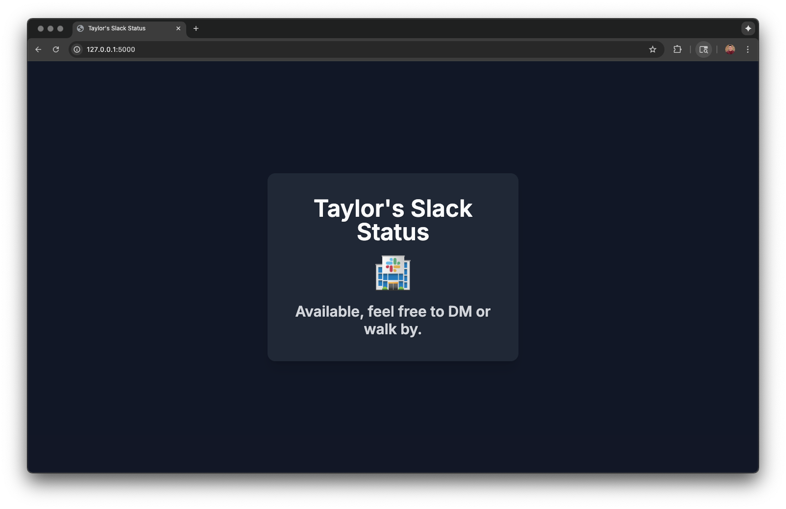

# Pi Slack Status

## Intro

This is a simple Python-based app for displaying your Slack status fullscreen on a Raspberry Pi. I designed the app around the display I'm [using](https://www.microcenter.com/product/632693/inland-35-inch-tft-lcd-touch-screen-monitor) but you can adjust the code to use whatever display output you need. 



## Dependencies & Setup

### Hardware Requirements
* A Raspberry Pi. (Any model that can run Python 3 should work, but as a warning, this was only tested on a Raspberry Pi 5.)
* A hardware display. 
* SSH accesss to the Raspberry Pi.
  
### Setup

#### OS Setup
1. Login to a shell and run updates on your Pi `sudo apt-get update -y && sudo apt-get full-upgrade -y`
2. Install any necessary drivers for your display. 
   1. If you're using the same display I used, use the `LCD35-show` driver from [this repository](https://github.com/goodtft/LCD-show).
   2. Make sure to enable I2C or SPI via `sudo raspi-config` > Interface Options if needed. Refer to your hardware documentation to find out.
3. Install the needed dependencies by running `sudo apt-get install python3-full python3-pip git`. 

#### Slack
##### Create a Slack App:
1. Go to [api.slack.com/apps](api.slack.com/apps).
2. Click "Create New App".
3. Choose "From scratch".
4. Give your app a name (e.g., "Pi Slack Status Display") and select your Slack workspace.
##### Add Scopes:
1. In your app's settings, navigate to "OAuth & Permissions".
2. Under "Scopes" -> "Bot Token Scopes", `add users.profile:read`.
##### Install App to Workspace:
1. At the top of the "OAuth & Permissions" page, click "Install to Workspace"
2. Authorize the app.
##### Get Bot User OAuth Token:
After installation, you'll see a "Bot User OAuth Token" (starts with xoxb-). Copy this token and keep it secure. This token will be used by your Python application.
##### Find your Slack User ID:
1. Open Slack in your browser.
2. Click on your profile picture in the top right corner.
3. Click "Profile".
4. In the sidebar that appears, click the "..." menu next to "Edit Profile".
5. Select "Copy member ID". It will look something like `U1234567890`. Save this along with your Bot Token from earlier.

#### Repository Setup
1. Clone this repository: `git clone https://github.com/untraceablez/pi_slack_status` and then `cd pi_slack_status`.
2. Create a Python virtual environment named *.venv* using this command: `python3 -m venv $HOME/.venv/pi-slack`
3. Run `source $HOME/.venv/pi-slack/bin/activate`. 
4. Run `pip install -r requirements.txt` to install the various Python dependencies.
5. Create a `.env` file by copying `.env_sample`: `cp .env_sample .env`. 
6. Paste in your User ID, API Token, and optionally, your Client Secret and Signing Secret (you'll need these if your Slack workspace enforces oAuth).
7. Go ahead and test the application by running `python3 pi_slack_status.py`.

 
#### Setup as a Service
0. **Before you do the steps below, modify the .service file with the correct paths and usernames. For example, I use Ansible in my homelab, and thus have ansible username instead of the default 'pi'**
1. In order to set this up as a startup service on the pi, first make the `start_pi_status.sh` file executable: `sudo chmod +x ./start_pi_status.sh`. 
2. Next, copy the contents of the `pi_status.service` file to your clipboard and create a systemd service file: `sudo nano /etc/systemd/system/pi_status.service` and paste the contents inside.
3. Run the following commands to enable and start the service: 
   ```
   sudo systemctl enable pi_status.service
   sudo systemctl start pi_status.service
   sudo systemctl daemon-reload
   ```
4. You should be able to reboot the Pi and see the screen load. Enjoy your new Slack status kiosk!